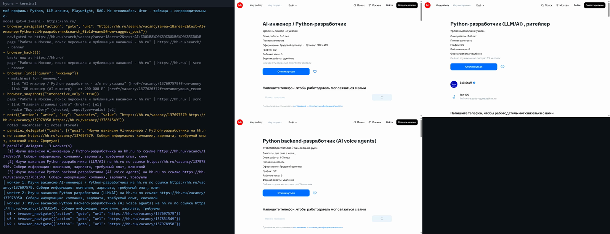
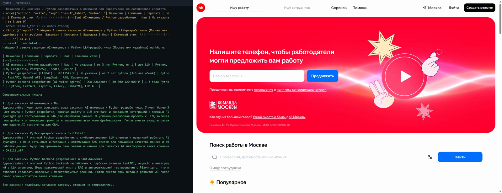

# Hydra

**Параллельный браузерный агент:** оркестратор + action-capable воркеры, каждый в своём окне Chromium.

Hydra не следует сценарию. Главный агент сам смотрит на страницу, решает, что делать дальше, и, когда задача распадается на независимые части, раздаёт их **параллельным воркерам**. У каждого воркера свой Playwright и полный набор действий: клик, ввод, навигация.

## Живое демо: hh.ru, три параллельных воркера

```powershell
uv run hydra --url https://hh.ru --record-video "Найди на hh.ru 3 свежие вакансии AI-инженера / Python LLM-разработчика (Москва или удалёнка). Собери ссылки на них со страницы поиска, затем изучи все 3 параллельно: компания, зарплата, требуемый опыт, ключевой стек, и для каждой напиши короткое сопроводительное под мой профиль: Python, LLM-агенты, Playwright, RAG. Не откликайся. Итог - таблица + сопроводительные."
```

Два видео одного сценария:

- [`demo/demo-screen-hh.mp4`](demo/demo-screen-hh.mp4) (93 с): **настоящая запись экрана** без монтажа. Слева обычный PowerShell, в котором запущен `hydra --layout split`, справа живые окна Chrome. Во время `parallel_delegate` главное окно сворачивается, и одновременно работают три окна воркеров. В конце виден итоговый отчёт.
- [`demo/demo-hh-parallel.mp4`](demo/demo-hh-parallel.mp4) (72 с): собран из `--record-video`. Слева панель со всеми tool calls, справа браузер, во время `parallel_delegate` справа сетка 2×2 из окон воркеров.



Что произошло в этом прогоне (`gpt-4.1-mini`, 8 шагов оркестратора, ~60 с, ~$0.02):

1. Оркестратор сам составил поиск, нашёл вакансии через `browser_find` и взял их адреса из `href` ссылок.
2. `parallel_delegate` запустил 3 воркера в отдельных Chromium. Каждый открыл свою вакансию, прочитал её и вернул отчёт с сопроводительным.
3. Оркестратор свёл отчёты в таблицу. Откликов не было: так просили в задаче, и safety gate всё равно не дал бы воркеру нажать «Откликнуться».



Второе видео, [`demo/demo-mail.mp4`](demo/demo-mail.mp4), снято на локальном демо-стенде: почта, удаление спама с подтверждением.

**Устойчивость.** После исправлений из раздела ниже этот же сценарий прогнан на живом hh.ru 4 раза подряд: 4 из 4 завершены (`completed`), во всех оркестратор делегировал вакансии воркерам, на прогон уходило 60–95 с и $0.02–0.05.

---

## Чем Hydra отличается от типичного sequential-агента

| Типичная слабость | Как это решено в Hydra |
| --- | --- |
| **Нет live-демо** на чужом сайте | Демо выше снято на настоящем hh.ru без единого зашитого селектора. `--record-video` + `scripts/make_video.py` собирают ролик «терминал + браузер» прямо из трейса прогона |
| **Один браузер, всё по очереди** | `parallel_delegate(tasks=[…])` → `ThreadPoolExecutor`, в каждом потоке свой `sync_playwright()` + `chromium.launch()` |
| **Субагенты только читают** | Воркеры **действуют**: click / type / select / navigate в своём окне. Cookies передаются им через `storage_state` |

Дополнительно есть `delegate_reading`: read-only помощник в **общем** окне оркестратора для длинных списков, где ничего не нужно менять.

---

## Архитектура

```
                    ┌─────────────────────────────┐
                    │     User / CLI (`hydra`)     │
                    └──────────────┬──────────────┘
                                   │
                    ┌──────────────▼──────────────┐
                    │   AgentLoop (оркестратор)    │
                    │   SYSTEM + Toolbox (main)    │
                    │   persistent Chromium        │
                    │   profile / cookies / tabs   │
                    └──────┬───────────┬──────────┘
                           │           │
           parallel_delegate│           │ delegate_reading
                           │           │ (shared browser)
              ┌────────────▼──┐   ┌────▼────────────┐
              │ ThreadPool     │   │ Reader (RO)     │
              │ max_workers=N  │   │ snapshot/find/  │
              └─┬─────┬─────┬─┘   │ read/scroll     │
                │     │     │     └─────────────────┘
         ┌──────▼┐ ┌──▼───┐ ┌▼──────┐
         │Worker1│ │Worker2│ │WorkerN│
         │ own   │ │ own   │ │ own   │
         │Chromium│ │Chromium│ │Chromium│
         │ ACT   │ │ ACT   │ │ ACT   │
         └───┬───┘ └───┬───┘ └───┬───┘
             └─────────┴─────────┘
                   merged reports
```

**Про sync Playwright:** один browser context нельзя безопасно делить между потоками. Поэтому параллельность устроена как **отдельный Playwright на каждый поток**, а не как несколько Page в одном процессе.

Перед `parallel_delegate` оркестратор экспортирует `storage_state.json` из persistent-профиля. Если пользователь залогинился в главном окне, воркеры стартуют уже залогиненными.

---

## Быстрый старт

Требования: Python 3.11+, [uv](https://github.com/astral-sh/uv), ключ OpenAI или Anthropic.

```powershell
cd hydra
uv venv --python 3.11
uv pip install -e ".[dev,video]"
.\.venv\Scripts\playwright.exe install chromium   # или системный Chrome, см. ниже

# если editable-install спотыкается о кириллицу в пути Windows:
$env:PYTHONPATH = (Resolve-Path src).Path

copy .env.example .env   # AGENT_PROVIDER=openai + OPENAI_API_KEY=...  (или ANTHROPIC_API_KEY)
uv run hydra --demo "Открой почту и перечисли темы входящих"
```

Если загрузка Chromium падает по таймауту, задайте `AGENT_BROWSER_CHANNEL=chrome` в `.env`, и агент будет работать через установленный Google Chrome.

Модели по умолчанию: `gpt-4.1-mini` для OpenAI, `claude-sonnet-4-5` для Anthropic. Переопределяются через `AGENT_MODEL` или `--model`.

| Флаг | Смысл |
| --- | --- |
| `--url` | Стартовая страница |
| `--demo` | Поднять `demo/site` на localhost |
| `--safety ask\|strict\|yolo` | Политика подтверждений |
| `--max-workers N` | Потолок параллельных воркеров |
| `--record-video` | Запись главного окна и окон воркеров в `runs/<ts>/` |
| `--profile-dir` | Persistent-профиль Chromium |
| `--headless` | Скрыть окна (для CI, не для демо) |
| `--layout split` | Левые 40% экрана остаются под терминал, главный браузер и воркеры (плиткой) справа, а на время `parallel_delegate` главное окно сворачивается: удобно для записи экрана |

Без задачи CLI входит в интерактивный REPL.

### Видео «терминал + браузер»

```powershell
python scripts/setup_video.py        # один раз: отдаёт Playwright системный ffmpeg (CDN Playwright часто недоступен)
uv run hydra --record-video --url https://hh.ru "…задача…"
python scripts/make_video.py runs/<ts> -o demo.mp4
```

`make_video.py` берёт из `trace.jsonl` каждый tool call с таймстемпом и рисует по нему панель терминала. Рядом ставится запись браузера, а пока работают воркеры, на этом месте сетка их окон. Так ролик синхронизирован с реальным прогоном без ручного монтажа.

---

## Процесс и решения

Каждая доработка ниже появилась после реального прогона: смотрел `runs/<ts>/trace.jsonl`, находил, где агент свернул не туда, и чинил общую причину, а не конкретный сайт.

| Что увидел в живом прогоне | Причина | Что сделал |
| --- | --- | --- |
| Оркестратор передал воркерам адреса вида `hh.ru/vacancy/e194`: подставил номер хэндла вместо id | В снапшоте не было `href` ссылок | `href` есть в outline и в `browser_find`. Длинные tracking-параметры сворачиваются в `?…`, короткие (`?id=5`) остаются. `browser_find` ищет и по адресу |
| Модель выпускала пачку кликов по одному снапшоту, после первого клика остальные хэндлы устаревали | OpenAI по умолчанию разрешает параллельные tool calls | `parallel_tool_calls=False`: одно действие за ход, затем diff |
| Падение `'ContentBlock' object has no attribute 'get'` на `browser_back()` | Пустой `input={}` считался ложным, и код уходил в ветку для dict | Единый `field_of()` для dict и SDK-объектов, есть регрессионный тест |
| 2 из 3 воркеров упали с 429 на `gpt-4.1` | Общий лимит 30k токенов в минуту на аккаунт | Ретраи с учётом retry-after. По умолчанию `gpt-4.1-mini` (лимит 200k) |
| Safety gate остановил Enter в поле поиска как «отправку формы» | LLM-judge перестраховался | Отправка поискового запроса (роль searchbox/combobox или «поиск» в имени) по правилам считается low |
| Воркер не уложился в шаги и вернул пустой отчёт; у оркестратора при исчерпании шагов была заглушка | Нет финального шага | И воркер, и оркестратор делают последний вызов «опиши, что успел» |
| Оркестратор 30+ шагов настраивал необязательные фильтры | Модель теряла главную цель | Каждые 12 шагов напоминание сверить прогресс с задачей |
| Воркер падал целиком, если первая загрузка страницы не укладывалась в таймаут | 4 Chrome одновременно грузят тяжёлый сайт | Таймаут первой загрузки 30 с, ошибка передаётся воркеру, а не убивает его |
| Отчёты иногда на английском при русской задаче | System prompt на английском перетягивал mini-модель | Язык ответа закреплён в сообщении с задачей |

Почему так устроено:

- **Playwright, sync API, отдельный экземпляр на поток.** Sync-объекты Playwright привязаны к своему потоку, и общий context между потоками ломается. Отдельный Chromium на воркер дороже по памяти, зато воркеры полностью независимы: свои вкладки, свои диалоги, сбой одного не трогает остальных.
- **Семантический outline вместо HTML и скриншотов.** Страница hh весит сотни КБ HTML, а outline видимой части — несколько КБ. Хэндлы `eNN` стабильны между снапшотами, поэтому после действия хватает diff.
- **OpenAI и Anthropic за одним интерфейсом.** Транскрипт хранится в формате Anthropic (tool_use/tool_result), адаптер переводит его в Chat Completions. Провайдер переключается через `.env`.

---

## Инструменты

### Браузер (оркестратор и воркеры)

`browser_snapshot`, `browser_find`, `browser_read_text`, `browser_click`, `browser_type`, `browser_select`, `browser_check`, `browser_scroll`, `browser_press`, `browser_wait`, `browser_tabs`, `browser_navigate`, `browser_back`, `browser_screenshot`

### Мета

`note`, `ask_user`, `finish`

### Параллелизм и делегирование

| Инструмент | Кто | Что делает |
| --- | --- | --- |
| **`parallel_delegate`** | только main | Список `{goal, start_url?}` → N action-воркеров → объединённый отчёт |
| **`delegate_reading`** | только main | Read-only помощник в **общем** окне |

Воркерам недоступны `parallel_delegate`, `ask_user` и `delegate_reading`: они выполняют свою цель и вызывают `finish`.

---

## Как агент видит страницу

HTML модели не передаётся. `browser_snapshot` возвращает семантический outline с хэндлами:

```
- link "AI/ML Engineer (LLM/RAG)" (href=/vacancy/137780796) [e37]
- combobox "Профессия, должность или компания" [e16]
- button "Найти" [e18]
```

После действия модель получает **diff** вместо полной страницы. У ссылок виден `href`, поэтому оркестратор может раздать воркерам реальные адреса.

## Контекст и память

1. **Сжатие на входе:** семантический outline или diff вместо HTML.
2. **Pruning:** старые наблюдения страницы схлопываются в одну строку, пары tool_use / tool_result сохраняются.
3. **Compaction:** при превышении бюджета ранняя часть истории заменяется handoff-заметкой модели.
4. **`note`:** факты вне транскрипта (цены, id, решения).

Контент страницы всегда обёрнут в `<page_content untrusted="true">`: это данные сайта, а не инструкции.

---

## Безопасность

- Лексические правила (ru+en) по имени элемента плюс опциональный LLM-judge.
- Режимы: `ask` (по умолчанию), `strict`, `yolo`.
- Пароли, номера карт и CVV блокируются жёстко, даже в `yolo`.
- У воркеров нет человека, поэтому действия риска medium/high **автоматически отклоняются**, низкий риск проходит.

---

## MCP (опционально)

Тот же toolbox можно отдать внешнему клиенту:

```bash
uv pip install -e ".[mcp]"
python -m hydra.mcp_server
```

`parallel_delegate`, `ask_user` и `finish` через MCP не экспонируются: ими управляет агентный цикл.

---

## Что намеренно НЕ захардкожено

Проверяется скриптом `scripts/check_no_hardcoding.py`:

- нет рецептов задач (`delete_spam`, `checkout`, …);
- нет селекторов `data-qa` / test-id под конкретные сайты;
- нет URL и названий площадок в system prompt;
- словарь риска в `safety.py` только **гейтит** действия и не выбирает элементы.

Лексикон сайта агент узнаёт из snapshot и find, как это делал бы человек.

---

## Честные ограничения

- Sync Playwright делает параллельность дороже по RAM: на каждого воркера отдельный Chromium.
- Воркеры не спрашивают пользователя, поэтому высокорисковые клики у них отсекаются.
- Нужен ключ API: без него полный live-прогон невозможен, тесты работают и так.
- Captcha, жёсткий bot-detection и 2FA остаются на человеке в главном окне.
- На mini-моделях маршрут недетерминирован: иногда оркестратор разбирает часть вакансий сам и делегирует воркерам только остальные.
- В режиме `--layout split` окна узкие, и сайты могут переключаться на мобильную вёрстку.

---

## Тесты без API-ключа

```powershell
$env:PYTHONPATH = (Resolve-Path src).Path
.\.venv\Scripts\python.exe -m pytest -q --timeout=120
```

64 теста: perception (outline, diff, href), safety, context, адаптер OpenAI, агентный цикл на scripted FakeLLM (включая исчерпание шагов), два настоящих параллельных Chromium-воркера, раскладка окон, MCP-сервер, persistence профиля.

---

Тестовое задание: автономный AI browser agent с упором на **параллельные action-деревья**. Пакет `hydra-browser`, CLI `hydra`.
